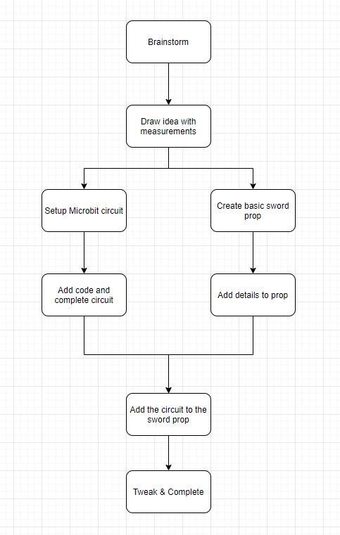
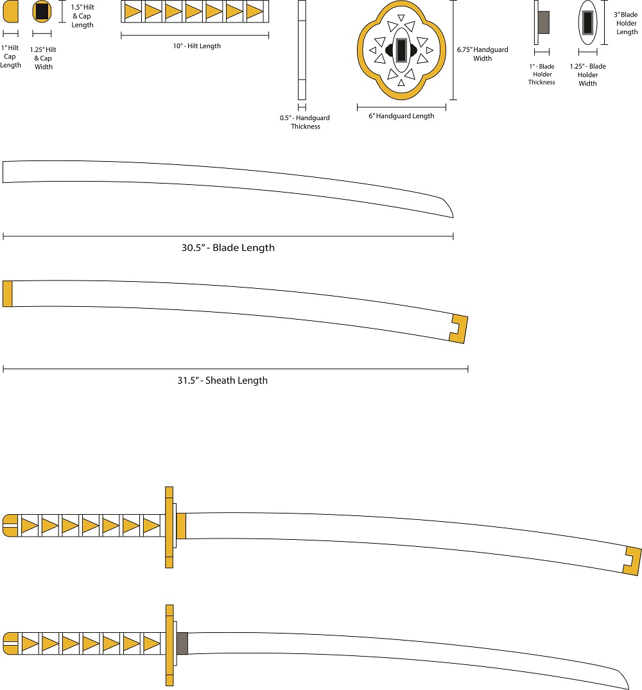
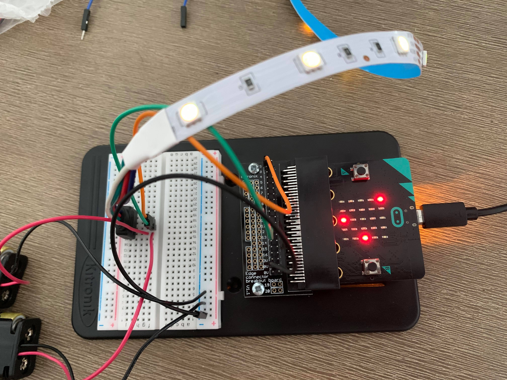
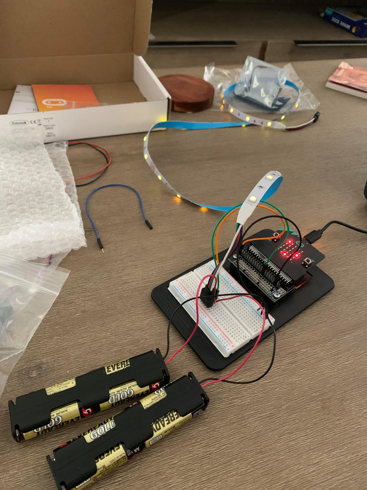

# 1701QCA Making Interaction - Assessment 2 workbook

You will use this workbook to keep track of your progress through the course and also as a process journal to document the making of your projects. The comments in italics throughout the template give suggestions about what to include. Feel free to delete those instructions when you have completed the sections.

When you have completed the template, submit the link to the GitHub Pages site for this repository as a link in Learning@Griffith. The link should be something like [https://qcainteractivemedia.github.io/1701QCA-Assessment2/](https://qcainteractivemedia.github.io/1701QCA-Assessment2/) where `qcainteractivemedia` is replaced with your GitHub username and `1701QCA-Assessment2` is replaced with whatever you called the repository this template is contained in when you set it up.

## Project working title ##
Thunderblade

## Related projects ##
### Related project 1 ###

How to make a Wooden Katana from hardwood flooring // Woodworking

https://www.youtube.com/watch?v=2nshBD9EbxE

I intially intended to use this video as a guide to creating my prop sword, however without access to woodworking equipment I was unable to use wood as my material.

### Related project 2 ###

Demon Slayer / Kimetsu No Yaiba LED Katana DIY kit ( TUTORIAL )

https://www.youtube.com/watch?v=WLo4PAFPa8E&t=334s

This video is partially what inspired me to make a glowing sword prop using acrylic for the blade. My version will be much larger and complex.

### Related project 3 ###

Light Katana (Making Of)

https://www.youtube.com/watch?v=tGIxBVOW96M

Similar to the previous related project this video also shows the making of a LED lit sword prop.

### Related project 4 ###

The PVC Katana Build-Along

https://www.youtube.com/watch?v=IH5fNfSK_3U

This project shows how to make a sword using PVC piping. I plan to only use PVC on my hilt and possibly handguard.

### Related project 5 ###

Katana tutorial - Samurai sword [How to make props]

https://www.youtube.com/watch?v=5YrxfzWIe28

This project uses EVA Foam to create a katana sword prop. This is my backup plan if Acrylic proves too difficult to use.

### Related project 6 ###

【Demon Slayer】Making Shinazugawa Zenitsu's Nichirin Sword 【Kimetsu No Yaiba】A Black Blade きめつのやいば 鬼滅

https://www.youtube.com/watch?v=wd_aL04VJHs&t=352s

This project uses wood and electricity to create a super cool lightning design on a sword, and then the design is filled with a glow in the dark powder.

## Conceptual progress ##

### Design intent ###

My design intent is to create a cosplay sword prop that incoporates the microbit. I plan to add lights and sounds.

### Design concept 1 ###

Initially I wanted to create my sword prop from wood using the laser cutter and workshop, however due to the Covid-19 pandemic this is no longer possible for me. I tried reaching out to some friends of friends that I knew did woodworking but I couldn't find anybody willing to let me use their workshop.

### Design concept 2 ###

My second idea was to create the sword mostly out of foam. While this would likely be the cheapest and easiest method I feel it wouldn't turn out the best and would be very delicate.

### Final design concept ###

My final decision was to use plastic for most of the sword design. For the hilt I plan to use PVC piping. This works well as I plan to store my battery packs inside the hilt, and the PVC pipes are already hollow. For the handguard and blade I intend to use acrylic either painted or covered in foam. I will house my microbit inside the hollow handguard and my LED Strip will run up the back of the blade. I will cover the blade and cut out a lightning design along the sides, so when the LED strip is turned on the light will pass through the acrylic and shine out of the lightning.

### Interaction flowchart ###

## Physical experimentation documentation ##

I laid out how I will create each piece of my prop and fit them together using Adobe Illustrator, and made sure to include measurements.

My current circuit layout to be improved upon.

I have figured out how to turn on my LED strip, I plan to make it more complex in the future, possibly with different movements adjusting how they light up.

## Design process discussion ##

So far I have planned out my sword and started on my microbit circuit.

## Next steps ##

Soon I will begin working on my sword and finish my microbit circuit. After both of those are complete I will put the circuit into the sword and it will be ready to submit.

